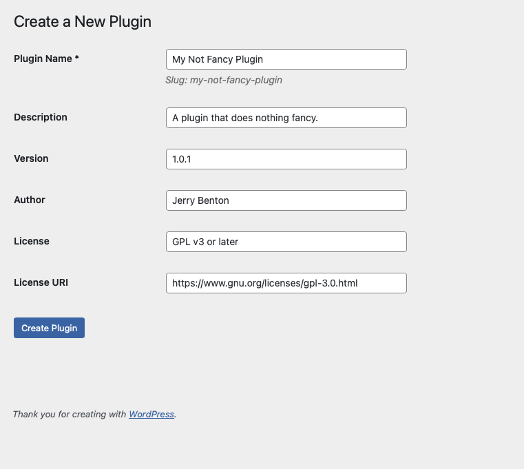

# Tokenlink Plugin Builder

**Contributors:** mailborder  
**Tags:** plugin builder, developer tools, create plugin, plugin creator  
**Requires at least:** 5.0  
**Tested up to:** 6.8  
**Requires PHP:** 7.4  
**Stable tag:** 1.0.5  
**License:** GPL v3 or later  
**License URI:** [https://www.gnu.org/licenses/gpl-3.0.html](https://www.gnu.org/licenses/gpl-3.0.html)

Lightweight internal plugin creator for WordPress developers. Quickly generate and activate a blank plugin directly from the admin dashboard.

---

## Description

**Tokenlink Plugin Builder** is a simple, secure utility for WordPress developers who want to rapidly prototype or create new plugins without leaving the dashboard.

It provides a minimal admin interface under **Plugins → Create Plugin** that lets you:

- Enter a plugin name and metadata  
- Automatically create a directory under `/wp-content/plugins/`  
- Generate a properly formatted PHP plugin header  
- Immediately activate the new plugin after creation  

No filesystem credential prompts, no legacy code, and no unnecessary overhead — just a clean, modern plugin builder designed for efficiency.

### Key Features

- Modernized code using current WordPress APIs  
- Works entirely within the admin area  
- Automatically sanitizes and validates user input  
- Fully compatible with WordPress multisite (when allowed)  
- Does not load unnecessary assets or libraries  
- Ideal for internal or development environments  

---

## Installation

There are three ways to install this plugin:

### From the WordPress Plugin Directory (Preferred)

1. In your WordPress admin dashboard, go to **Plugins → Add New**.  
2. Search for **Tokenlink Plugin Builder**.  
3. Click **Install Now**, then **Activate**.

### Upload via ZIP File

1. Download the plugin ZIP file from [mailborder.com](https://www.mailborder.com/tokenlink-plugin-builder) or from WordPress.org.  
2. In your WordPress admin dashboard, go to **Plugins → Add New** and click **Upload Plugin** at the top.  
3. Select the ZIP file and click **Install Now**.  
4. When installation completes, click **Activate Plugin**.

### Manual Installation (FTP or File Manager)

1. Download the plugin ZIP file and extract it on your computer.  
2. Upload the extracted folder to `/wp-content/plugins/` using FTP or your hosting file manager.  
3. Activate it through the **Plugins** menu in WordPress.

---

## Usage

1. Fill in the plugin name and optional fields (description, version, author, license).  
2. Click **Create Plugin**.  
3. The new plugin directory and PHP file will be created automatically and activated.

Each plugin is created under: /wp-content/plugins/{your-slug}/ with a single PHP file containing a standard WordPress plugin header.

---

## Security

- Only users with the `edit_plugins` capability can access the builder.  
- All form input is sanitized before writing files.  
- No remote calls or external dependencies are used.

---

## Changelog

### 1.0.5
- Code cleanup and enhancements  
- Added pre-populated license fields  
- Improved slug generation logic  
- JavaScript slug preview added  

### 1.0.1
- Initial release  
- Hardened against bad input and permissions misuse  

---

## Frequently Asked Questions

### Can it generate plugin skeletons or admin pages?

Not yet — this version only generates a clean header and activates the plugin. You can extend it easily for skeleton templates.

### Is it safe to use on production sites?

It is lightweight and secure, but it is intended primarily for **development** or internal admin use.  
Best course of action is to have it disabled when not needed for creating a plugin.

---

## Screenshot

---

## Author

Developed by **Mailborder Systems (Jerry Benton)**  
Website: [https://www.mailborder.com](https://www.mailborder.com)  
GitHub: [https://github.com/jcbenton/tokenlink-plugin-builder](https://github.com/jcbenton/tokenlink-plugin-builder)

---

## License

This plugin is licensed under the GNU General Public License v3 or later.  
See [https://www.gnu.org/licenses/gpl-3.0.html](https://www.gnu.org/licenses/gpl-3.0.html) for details.
